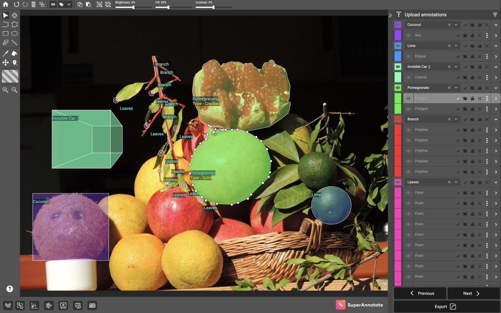
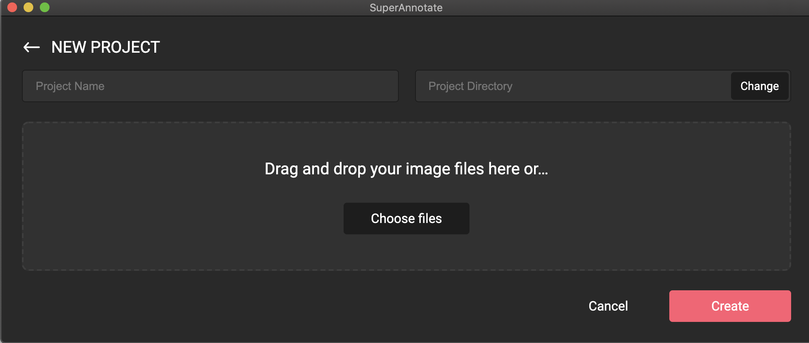
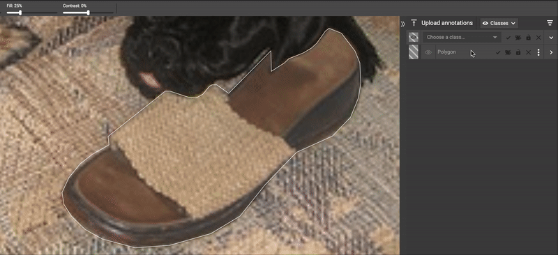
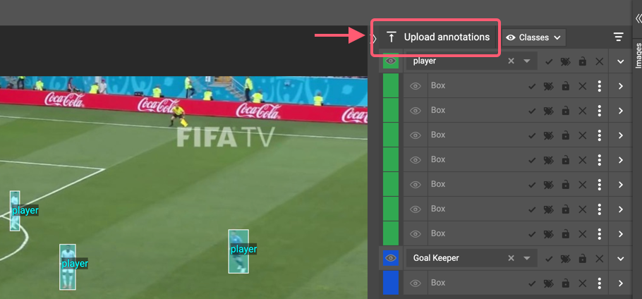

# SuperAnnotate Desktop
SuperAnnotate Desktop is the fastest image and video annotation software. It was built based on SuperAnnotate's web platform which is designed based on feedback from thousands of annotators that have spent hundreds of thousands of hours on labeling. The tool allows computer vision engineers or small annotation teams to quickly annotate images/videos, as well as it provides efficient features to explore already labeled datasets. 



- [Download and Installation Guide](#download-and-installation-guide)
- [Introduction](#introduction)
- [Project Set up](#project-set-up)
- [SDK and Annotation Upload](#sdk-and-annotation-upload)
- [Export](#export)
- [Relevant Posts and Reading Materials](#relevant-posts-and-reading-materials)


## Download and Installation Guide

Your image annotation software is one click away! Click [here](https://superannotate.com/download/?utm_source=github&utm_medium=article&utm_campaign=SuperAnnotate_Desktop_Launch) to download the installer package on Mac, Windows or Linux. Install the package by simply double-clicking on it and follow the installation steps.


## Introduction

- **Welcome to SuperAnnotate**

	SuperAnnotate provides a free annotation software that is built to accommodate a vast range of annotation tasks: from object detection, instance and semantic segmentation, keypoint annotation, cuboid annotation to video tracking. SuperAnnotate will allow you to go through your annotation project effortlessly in the most efficient manner.  

- **What problem does it solve?**
	
    SuperAnnotate allows you to create high-quality training datasets for various computer vision tasks. It accelerates the cycle of training data creation by at least three times, without compromising the annotation quality. It also provides the opportunity to explore annotated datasets and allows you to filter and correct the annotations based on your needs. 
    
- **What is it good for?**

	The software is ideal for individual researchers and small annotation teams who aim to accomplish simple computer vision tasks. Completing more complex tasks and managing large teams can be done using [SuperAnnotate’s web platform](https://www.superannotate.com/)

- **How to level up**

	Regardless of team and project size, [SuperAnnotate’s web platform](https://www.superannotate.com/) provides uniform and consistent results, allowing you to manage large teams and follow their progress. You can also automate the annotation progress using neural networks and integrate your computer vision pipeline using Python SDK . Submit the form [here](https://www.superannotate.com/contacts) to level up.


## Project set up

**Create project and set up classes**



Once installed, you are all set to start your first project. To create a project, give it a name, choose a project directory, and then upload the images you want to annotate. You can also start a new project by choosing the directory of the previous annotated projects. 



You can set up classes directly from the labeling panel in the editor by either uploading the classes.json file or manually creating the class ontology. 

**Open an existing object**

Alternatively, you can open an existing project by choosing the path to your project file.


**Labeling and the editor**

After successfully installing and creating your projects and classes, use the editor to annotate the images. Please check the following links to become familiar with the editor.

- **[Desktop and web editor tutorials](https://www.youtube.com/channel/UCmwDrqxvNiTmnNOKl-m0GjA/playlists?view_as=subscriber)**
- **[Advanced editor features](https://www.youtube.com/watch?v=_wFYtQY3v14&feature=youtu.be)**
- **[Lunch announcement](https://blog.superannotate.com/superannotate-desktop-a-better-alternative-to-free-annotation-tools)**


## SDK and Annotation Upload

Even if you have a large amount of annotated data in other tools or platforms, you can still upload your annotations to SuperAnnotate Desktop and perform a quality check. Using the editor filters (learn more [here](https://blog.superannotate.com/superannotate-desktop-a-better-alternative-to-free-annotation-tools), Section 3), one can search and edit all the objects with a certain class which can be essential for checking and correcting your algorithm’s prediction accuracy or the annotation quality. 
You can transfer your annotation from other open-source tools and paid platforms. For the conversion, you can use our Python SDK which provides all the conversion scripts to make an easy transition. Here is an example:

Run this commands to install SDK and important repositories

	pip install superannotate
	pip install 'git+https://github.com/cocodataset/panopticapi.git'
	pip install 'git+https://github.com/philferriere/cocoapi.git#egg=pycocotools&subdirectory=PythonAPI'

Now you can use this script to convert your data to SuperAnnotate format

```python
import superannotate as sa
sa.import_annotation_format("<input_dir>", "<output_dir>", "<dataset_format>",
			    "<dataset_name>", "<project_type>", "<task>", "<platform>")
```

Once you receive the converted JSON file in SuperAnnotate format, you can simply upload your annotations in our editor. 



The SDK supports the conversion of the following formats from SuperAnotate (SA) and to SuperAnnotate (SA).

| DATASET |TO SA | FROM SA |
| :--- | :---: | :---: | 
| [COCO](https://cocodataset.org/#home) | X | X |
| [PASCAL VOC](http://host.robots.ox.ac.uk/pascal/VOC/) | X |  |
| [LabelBox](https://labelbox.com/) | X | |
| [Supervisely](https://supervise.ly/) | Coming soon | |
| [DataLoop](https://dataloop.ai/) | Coming soon | |
| [Cityscapes](https://www.cityscapes-dataset.com/) | Coming soon | |
| [LabelMe](http://labelme.csail.mit.edu/Release3.0/) | Coming soon | |
| [YOLO darknet](https://pjreddie.com/darknet/) | Coming soon | |
| [AWS SageMaker](https://aws.amazon.com/sagemaker/) | Coming soon | |
| [Google Cloud AutoML](https://cloud.google.com/vision/automl/docs) | Coming soon | |
| [VoTT](https://github.com/microsoft/VoTT) | Coming soon | |
| [VGG](http://www.robots.ox.ac.uk/~vgg/software/via/) | Coming soon | |

## Export

**Classes.json**

`classes.json` file contains all the information about the classes. Find an example below:

```json
[{
	"id":1,
	"project_id":0,
	"name":"Class 1",
	"color":"#32a852",
	"attribute_groups":[{
		"id":3, 
		"class_id": 1, 
		"name": 
		"color_list", 
		"attributes":[{
			"id": 5, 
			"group_id": 3, 
			"name": "blue"
			},{
			"id": 6, 
			"group_id": 3, 
			"name": "red"}]
	}]
},{
	"id":2,
	"project_id":0,
	"name":"Class 2",
	"color":"#46b761",
	"attribute_groups":[{
		"id": 4, 
		"class_id": 2, 
		"name": "shape", 
		"attributes":[{
			"id":7, 
			"group_id": 4, 
			"name": "cube"
			},{
			"id":8, 
			"group_id": 4, 
			"name":"sphere"}]
	}]
}]
```

`annotations.json` file contains all the information regarding image annotation. There can be multiple types of annotations. Here are some examples:  

```
{
	"01.jpg":[annotations_list_and_metadata],
	“02.jpg”:[annotations_list_and_metadata]
}		
```

Annotation types and their json structures:		

**Box** 
```json
{
	"attributes":[{"id": 3, "group_id": 4}],
	"classId":1,
	"groupId":0,
	"locked":false,
	"pointLabels":{},
	"points":{
		"x1":98.3,
		"x2":300.5,
		"y1":136.7,
		"y2":362.9
		},
	"probability":100,
	"type":"bbox",
	"visible":true
}
```
**Polygon**
```json
{
	"attributes":[{"id": 5, "group_id": 6}],
	"classId":2,
	"groupId":0,
	"locked":false,
	"pointLabels":{},
	"points":[
		21.6, 242.2,
		37.1, 193.3,
		109.1, 209.3,
		90.5, 254.5,
		19.4, 243.0
		],
	"probability":100,
	"type":"polygon",
	"visible":true
}
```
**Point**
```json
{
	"type":"point",
	"classId":-1,
	"probability":100,
	"x":123.1,
	"y":289.7,
	"groupId":0,
	"pointLabels":{},
	"locked":false,
	"visible":true,
	"Attributes":[{"id": 7, "group_id": 8}]
}
```
**Polyline**
```json
{
	"type":"polyline",
	"classId":4,
	"probability":100,
	"points":[
		13.1, 223.2,
		49.1, 230.4,
		154, 268.5,
		580.9, 538
		],
	"groupId":0,
	"pointLabels":{},
	"locked":false,
	"visible":true,
	"attributes":[{"id": 9, "group_id": 10}]
},
```
**Ellipse**
```json
{
	"type":"ellipse",
	"classId":3,
	"probability":100,
	"cx":365.3,
	"cy":288.1,
	"rx":334.6,
	"ry":178.9,
	"angle":0,
	"groupId":0,
	"pointLabels":{},
	"locked":false,
	"visible":true,
	"attributes":[{"id": 11, "group_id": 12}]
},
```

**Cuboid**
```json
{
	"attributes":[{"id": 13, "group_id": 14}],
	"classId":3,
	"groupId":0,
	"locked":false,
	"pointLabels":{},
	"points":{
		"f1":{
			"x":552.1,
			"y":205.4
			},
		"f2":{
			"x":646.0,
			"y":826.9
			},
		"r1":{
			"x":411.3,
			"y":232.5
			},
		"r2":{
			"x":505.2,
			"y":854.0
			}
		},
	"probability":100,
	"type":"cuboid",
	"visible":true
}
```


## Relevant Posts and Reading Materials

Some text description 

- **[Python SDK Documentation](https://superannotate.readthedocs.io/en/latest/index.html)**
- **[Detecting Mislabeled Annotations with Superannotate](https://github.com/superannotateai/qa-automation)**
- **[Speed up image labeling using transfer learning (no code required)](https://blog.superannotate.com/speed-up-labeling-process-using-transfer-learning)**
- **[How to efficiently manage work-from-home annotation service teams?](https://blog.superannotate.com/ai-annotation-during-covid-19)**
- **[Active Learning using SuperAnnotate?](https://github.com/superannotateai/active_learning)**
- **[Why Pixel Precision is the future of Image Annotate](https://blog.superannotate.com/why-pixel-precision-is-the-future-of-the-image-annotation)**
- **[Full Documentation for SuperAnnotate Web](https://superannotate.com/documentation)**


